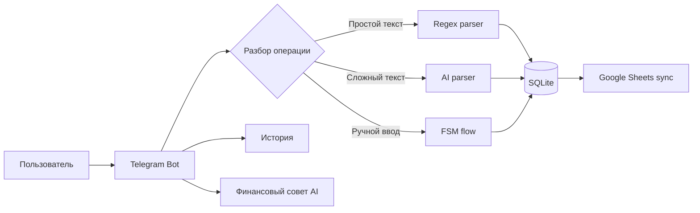

# FintorAI

**FintorAI** — мой ранний проект персонального финансового ассистента, разработка которого началась в **июле 2025 года**.

Изначально идея была простой: вести доходы и расходы в **Google Sheets** — хранить операции в таблице, использовать категории и постепенно автоматизировать личный финансовый учёт.

По мере развития проекта стало понятно, что постоянно открывать таблицу и вручную вносить данные неудобно. Поэтому FintorAI начал развиваться в сторону **Telegram-бота**: пользователь пишет обычным текстом, например `кофе 1200`, а бот помогает сохранить и обработать операцию.

Со временем эта идея выросла в отдельный, значительно более крупный проект — **Qarjym**. FintorAI остался важным ранним этапом: именно здесь проверялись базовые идеи быстрого ввода расходов, AI-разбора операций, категорий, истории и синхронизации финансовых данных.

> **Qarjym — продолжение идеи FintorAI.** Сейчас проект развивается отдельно и продолжает дорабатываться. Текущий отдельный live demo Qarjym: [@qarjym_bot](https://t.me/qarjym_bot). Это не тот же deployment, что исторический FintorAI.

## Как развивался проект

### 1. Google Sheets

Первая версия идеи строилась вокруг Google Sheets:

- доходы и расходы хранятся в таблице;
- операции распределяются по категориям, группам и подкатегориям;
- таблица используется как простой финансовый журнал и основа для отчётности.

### 2. FintorAI в Telegram

Следующим шагом стала автоматизация ввода через Telegram. Вместо постоянной работы с таблицей пользователь может взаимодействовать с ботом:

- написать простую операцию: `такси 2500`;
- добавить операцию вручную по шагам;
- посмотреть последние операции;
- открыть отчёт в Google Sheets;
- задать финансовый вопрос AI;
- использовать AI для разбора более сложного текста.

### 3. Локальная история + синхронизация

В проект был добавлен SQLite. Операция сначала сохраняется в локальную базу, а затем синхронизируется с Google Sheets.

Если Google Sheets временно недоступен, локально сохранённая операция больше не теряется: бот сообщает о проблеме синхронизации и продолжает работу.

### 4. Эволюция в Qarjym

Позже стало понятно, что идея может быть намного шире простого Telegram-бота и таблицы. На основе опыта FintorAI появился отдельный проект **Qarjym** — более полноценная система персональных финансов с отдельной архитектурой, интерфейсами и дальнейшим развитием продукта.

FintorAI и Qarjym — не один и тот же репозиторий и не один deployment. Этот репозиторий показывает ранний этап развития идеи.

## Что умеет текущий FintorAI

- Telegram-интерфейс на `aiogram`;
- быстрый ввод операций обычным текстом;
- regex-парсер для простых операций;
- AI-разбор более сложных финансовых записей;
- пошаговый ручной ввод через FSM;
- локальная история операций в SQLite;
- синхронизация с Google Sheets;
- категории / группы / подкатегории;
- команда финансового совета через AI;
- fallback на встроенные категории при временной недоступности справочника Google Sheets;
- обработка основных ошибок внешних сервисов.

## Архитектура



Основной принцип ранней версии: **ввести операцию максимально быстро, сохранить её локально и при возможности синхронизировать с таблицей**.

## Структура

- `bot.py` — Telegram handlers, FSM и основной workflow;
- `database.py` — SQLite / SQLAlchemy;
- `services/openai_client.py` — AI-разбор операций и финансовые ответы;
- `services/google_sheets.py` — работа с Google Sheets;
- `keyboards/inline.py` — Telegram inline-кнопки;
- `middlewares/error_handler.py` — обработка необработанных ошибок;
- `import_from_sheets.py` — перенос существующих записей из Google Sheets в SQLite;
- `states.py` — состояния ручного ввода.

## Запуск

Требуется Python 3.10+. Публичный snapshot дополнительно проверяется на Python 3.12.

```bash
python3 -m venv .venv
source .venv/bin/activate
pip install -r requirements.txt
cp .env.example .env
```

Заполните `.env` своими значениями:

```env
TELEGRAM_BOT_TOKEN=...
OPENAI_API_KEY=...
GOOGLE_CREDENTIALS_JSON_PATH=credentials.json
SPREADSHEET_ID=...
CACHE_TTL_SECONDS=3600
OPENAI_TRANSACTION_MODEL=gpt-4o-mini
OPENAI_ADVICE_MODEL=gpt-4o-mini
```

Затем:

```bash
python3 bot.py
```

Названия AI-моделей задаются через `.env`, поэтому их можно менять без правки исходного кода.

Реальные токены, ключи, базы данных и Google service-account credentials нельзя коммитить в Git.

## Проверка публичного snapshot

Для быстрой проверки структуры репозитория без реальных credentials:

```bash
python3 scripts/verify_public_snapshot.py
```

Проверка контролирует Python syntax, локальные импорты, запрещённые файлы и несколько распространённых сигнатур секретов.

## Почему здесь новая Git-история

Оригинальный FintorAI — приватный проект с историей разработки с июля 2025 года. В старой истории репозитория присутствовали приватные конфигурационные данные, поэтому делать исходный repository публичным небезопасно.

Этот `FintorAI-public` — **sanitized public snapshot** текущего безопасного исходного кода. Он намеренно имеет новую Git-историю. Старые даты коммитов не подделывались и приватная история не переносилась.

Подробнее: [`PROVENANCE.md`](PROVENANCE.md) и [`SECURITY.md`](SECURITY.md).

## Ограничения раннего прототипа

FintorAI создавался как персональный эксперимент, а не как готовый публичный multi-user сервис. Интеграция Google Sheets рассчитана на одну настроенную таблицу владельца; для полноценного многопользовательского продукта нужна отдельная модель доступа, изоляция данных и production-инфраструктура. Эти задачи уже относятся к следующему этапу развития идеи, а не к историческому snapshot FintorAI.

## Статус проекта

FintorAI — запускаемый ранний прототип и исторический этап развития продукта при корректно настроенных собственных credentials. Он не позиционируется как production-ready финансовый сервис.

Развитие основной идеи продолжается в **Qarjym**. Проект будет дальше дорабатываться и после HackAlem: улучшаться будут пользовательский сценарий, автоматизация финансового учёта, AI-функции и интерфейсы.

**Live demo отдельного текущего Qarjym:** [@qarjym_bot](https://t.me/qarjym_bot)
